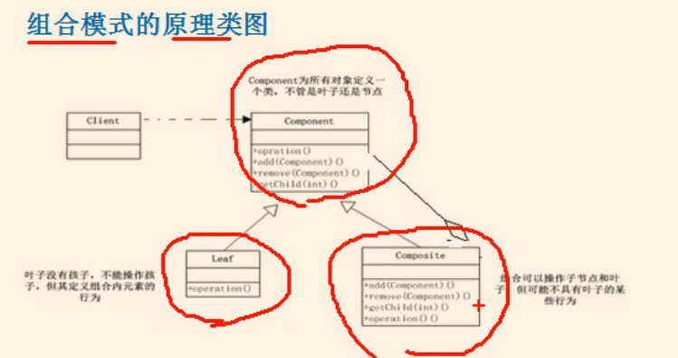
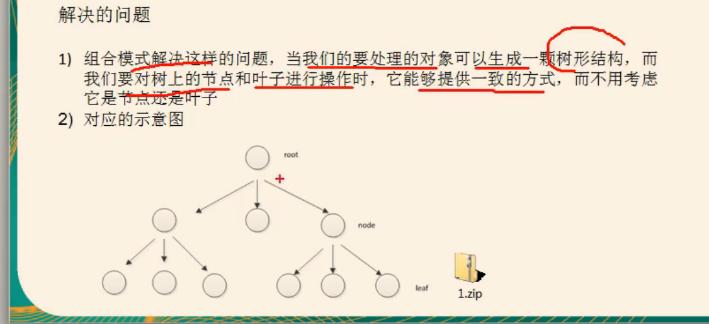
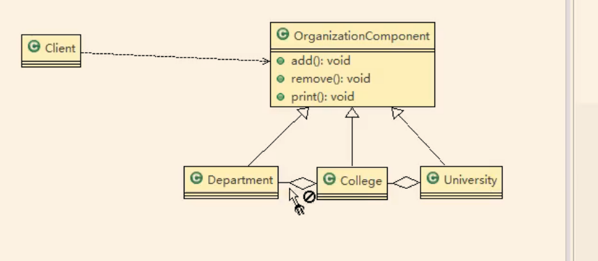
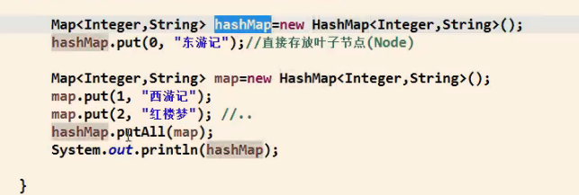
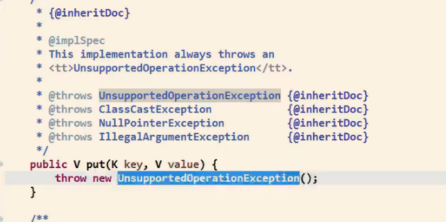

//案例背景学校与学院专业的组织结构


基本介绍

1）组合模式（ Composite Pattern），又叫部分整体模式，它创建了对象组的树形结构，将对象组合成树状结构以表示“整体部分”的层次关系。

2）组合模式依据树形结构来组合对象，用来表示部分以及整体层次

3）这种类型的设计模式属于结构型模式

4）组合模式使得用户对单个对象和组合对象的访问具有一致性，即：组合能让客户以一致的方式处理个别对象以及组合对象


//图


component 可以是抽象类。接口。甚至是具体类





//uml图




//code


hashmap用到了组合模式。有兴趣可以去看下源码




有个默认实现的方法东西。。和上面的代码里面的一样，说明需要子类进行实现，而叶子节点不需要。



```java
//AbstractMap中
/**
     * {@inheritDoc}
     *
     * @implSpec
     * This implementation always throws an
     * <tt>UnsupportedOperationException</tt>.
     *
     * @throws UnsupportedOperationException {@inheritDoc}
     * @throws ClassCastException            {@inheritDoc}
     * @throws NullPointerException          {@inheritDoc}
     * @throws IllegalArgumentException      {@inheritDoc}
     */
    public V put(K key, V value) {
        throw new UnsupportedOperationException();
    }
//hashmap中
    /**
     * Associates the specified value with the specified key in this map.
     * If the map previously contained a mapping for the key, the old
     * value is replaced.
     *
     * @param key key with which the specified value is to be associated
     * @param value value to be associated with the specified key
     * @return the previous value associated with <tt>key</tt>, or
     *         <tt>null</tt> if there was no mapping for <tt>key</tt>.
     *         (A <tt>null</tt> return can also indicate that the map
     *         previously associated <tt>null</tt> with <tt>key</tt>.)
     */
    public V put(K key, V value) {
        return putVal(hash(key), key, value, false, true);
    }
```

叶子节点就是Node 内部类

```java
//HashMap中
/**
     * Basic hash bin node, used for most entries.  (See below for
     * TreeNode subclass, and in LinkedHashMap for its Entry subclass.)
     */
    static class Node<K,V> implements Map.Entry<K,V> {
        final int hash;
        final K key;
        V value;
        Node<K,V> next;

        Node(int hash, K key, V value, Node<K,V> next) {
            this.hash = hash;
            this.key = key;
            this.value = value;
            this.next = next;
        }
```


小结：


组合模式的注意事项和细书

1）简化客户端操作。客户端只需要面对一致的对象而不用考虑整体部分或者节点叶子的问题

2）具有较强的扩展性。当我们要更改组合对象时，我们只需要调整内部的层次关系客户端不用做出任何改动

3）方便创建出复杂的层次结构。客户端不用理会组合里面的组成细节，容易添加节点或者叶子从而创建出复杂的树形结构

4）需要遍历组织机构，或者处理的对象具有树形结构时，非常适合使用组合模式

5）要求较高的抽象性，如果节点和叶子有很多差异性的话，比如很多方法和属性都不一样，不适合使用组合模式