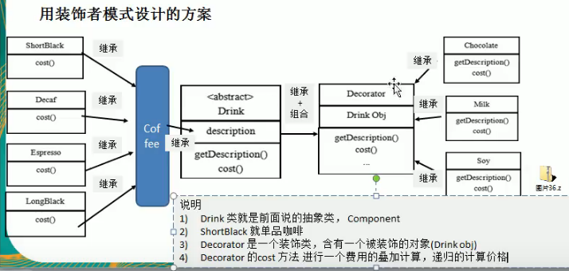
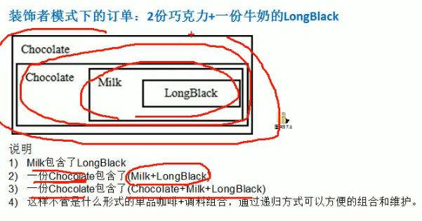
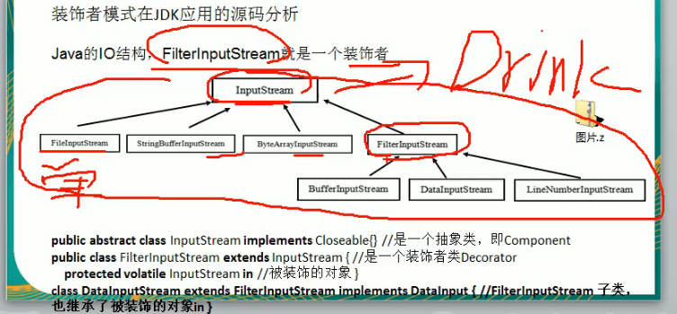
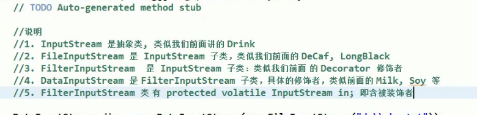

//星爸爸 咖啡案例

咖啡的种类/ 意大利咖啡，美式咖啡 short balck。。。

调料：糖 。奶

传统方法：意大利咖啡+糖，意大利咖啡+奶，意大利咖啡+糖+奶。。。。全排列的形式可能

装饰者模式

1）装饰者模式：动态的将新功能附加到对象上。在对象功能扩展方面，它比继承更有弹性，装饰者視式世体现了开闭原则ocp

2）这里提到的动态的将新功能附加到对象和ocp原则，在后面的应用实例上会以代码的形式体现，

角色

被装饰者：类似于 陶瓷，衣服

装饰者： 泡沫，木板，塑料袋

理解的意思是： 陶瓷在邮寄的时候需要用泡沫木板进行包装好，装饰一下再邮寄出去。 而衣服可能只需要用塑料袋报一下就可以了。

图

//code

装饰者模式在jdk中的io流中有用到。

