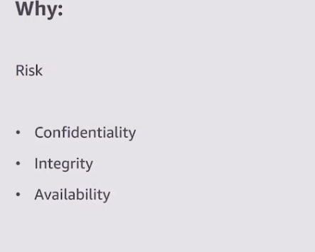
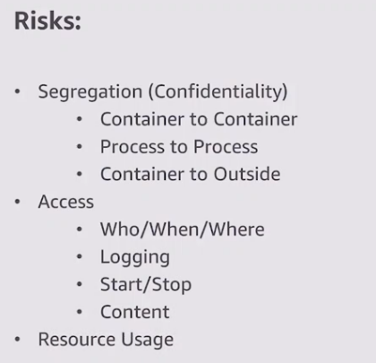
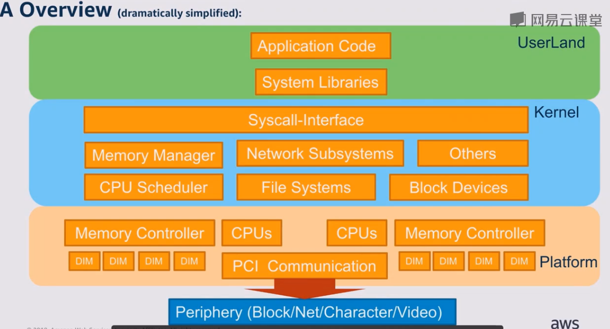
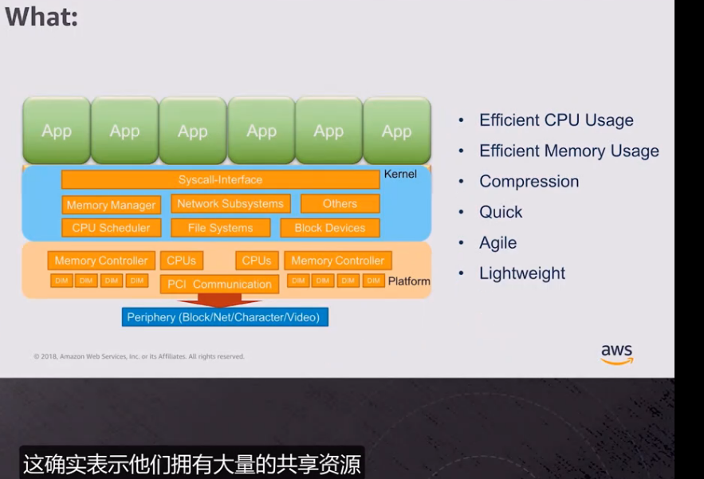
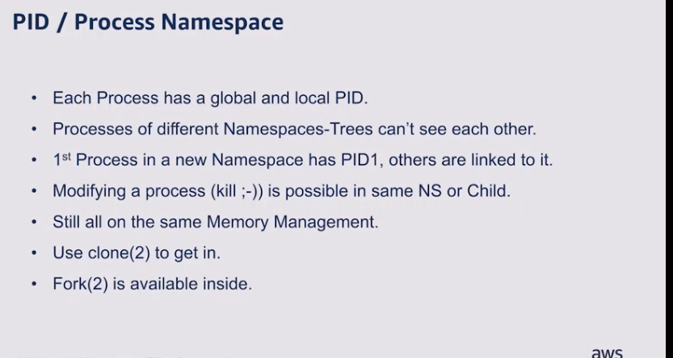
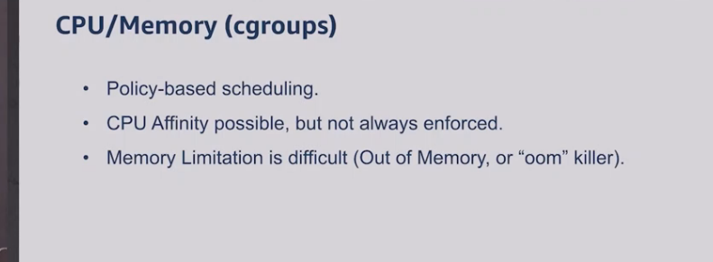
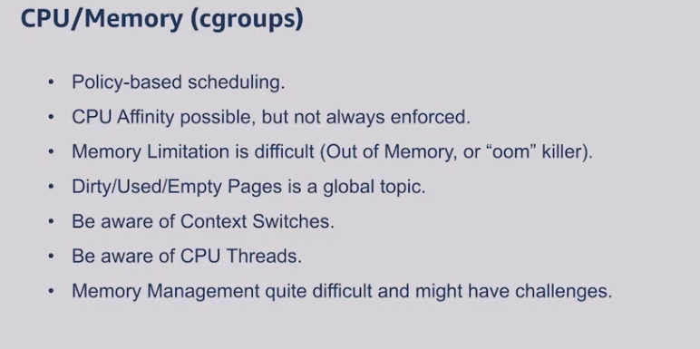
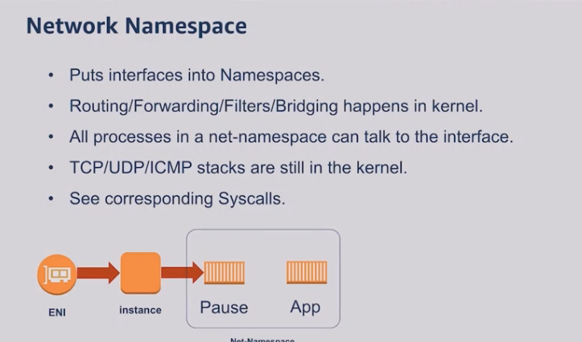
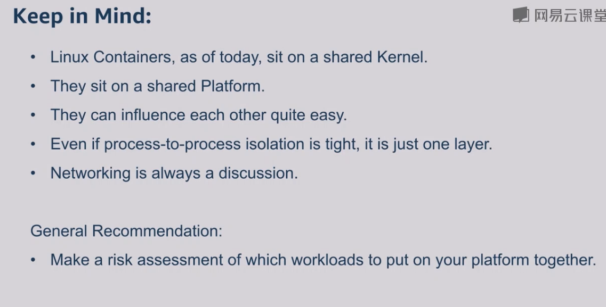
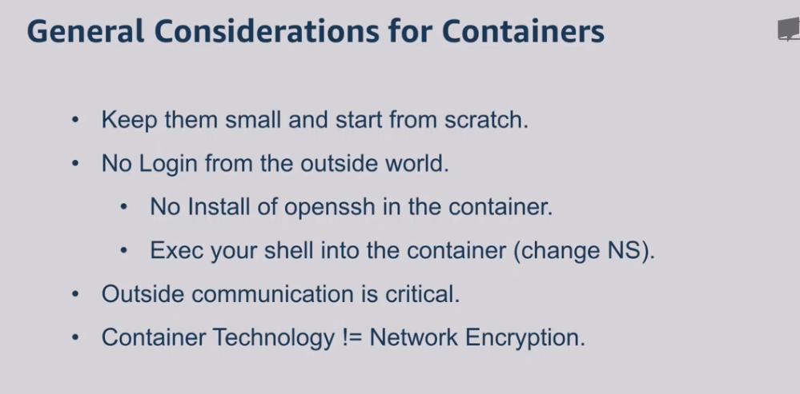

## 容器的安全性

视频地址：

https://study.163.com/course/courseMain.htm?courseId=1212165804

了解即可这个内容。不是太相关：

**主要是想强调，使用容器等技术，需要知道他们潜在的一些风险，因为技术的新带来的是风险的高。**

容器的风险

 

计算机应用的架构

大量的应用共同使用同一套系统资源

pid进程的隔离性

使用容器的时候需要考虑命名空间和内存，>>>什么玩意?不懂。

网络命名空间

 

