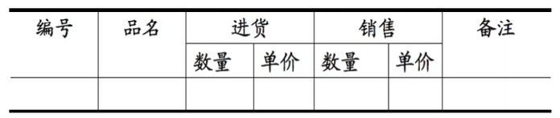
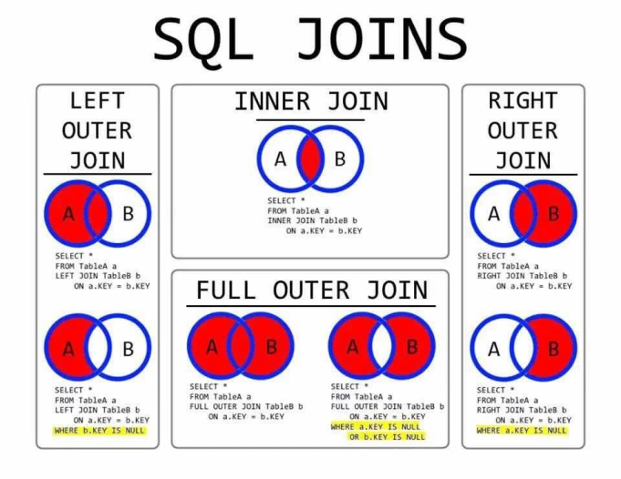
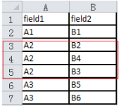
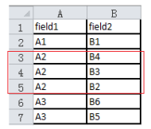

# 数据库的知识点
学习过程中遇到的问题  

# 什么是范式  
范式：  
范式有五种：第一范式，第二范式，第三范式，BCFN范式，第四范式，第五范式。**一般满足第三范式即可！**  

第一范式：要求有主键，并且要求每一个字段原子性不可再分  
第二范式：要求所有非主键字段完全依赖主键，不能产生部分依赖  
第三范式：所有非主键字段和主键字段之间不能产生传递依赖  
  
举例子：  
第一范式：数据库表中的字段都是单一属性的，不可再分，没有重复的列  
 

  
第二范式：属性完全依赖于主键  
就是有一个标识可以唯一确定一个实例，为实现区分通常需要为表加上一个列，以存储各个实例的惟一标识。例如：员工信息表中加上了员工编号（emp_id）列，因为每个员工的员工编号是惟一的，因此每个员工可以被惟一区分。这个惟一属性列被称为主关键字或主键、主码。  

第三范式：就是属性不依赖于其它非主属性  
例如，存在一个部门信息表，其中每个部门有部门编号（dept_id）、部门名称、部门简介等信息。那么在的员工信息表中列出部门编号后就不能再将部门名称、部门简介等与部门有关的信息再加入员工信息表中。  
  

# 数据库的隔离级别  
| **隔离级别（强度依次递增）** | **产生的问题**                                              | **例子**                                                     | **解决办法**                                                 |
| ---------------------------- | ----------------------------------------------------------- | ------------------------------------------------------------ | ------------------------------------------------------------ |
| READ_UNCOMMITTED（读未提交） | 脏读：一个事务读取了另一个事务未提交的数据                  | 张三的工资为1000元，财务人员在某个时刻修改为2000元，此时，张三本人去查工资发现工资张涨了为2000元，但是后来，财务人员发现数据输入错误，回滚了事务，此时张三的工资又为1000元 | 事务为提交前，不能读取修改过的数据，隔离级别升级为READ_COMMITTED及以上 |
| READ_COMMITTED（ 读已提交）  | 不可重复读 ：一个事务导致另一个事务前后两次读取的数据不一致 | 张三连续两次读取工资，第一次为1000元，在两次读取数据的间隙中，财务人员修改了该数据为2000元，并提交了事务，张三第二次读取工资的时候发现为2000元，两次读取的数据不一致 | 事务在完全修改提交后，才能使用数据，隔离级别升级为REPEATABLE_READ及以上 |
| REPEATABLE_READ（可重复读）  | 幻读：一个事务导致另一个事务前后两次的执行结果不一致        | 操作员A执行查询工资为1000元的人数，假设为10条，操作员B执行了插入操作，插入了2条工资为1000元的数据，操作员A再次执行查询的时候会发现有：12条数据。 | 操作事务完成数据处理之前，其他任何事务都不能操作数据,隔离级别升级为SERIALIZABLE |
| SERIALIZABLE（串行化）       | 基本上解决以上的问题，带来的问题也有，开销大。              |                                                              |                                                              |
 
## 索引的不足之处  
代价： 索引需要占硬盘空间，空间代价，一旦插入新的数据，就需要创建新的索引，时间代价  
场景：数据规模大（几百万条），字段使用重复频率  

## SQL JOINS 图解  
一图解释清楚left outer join 和 right outer join 的区别  


## Oracle的伪列以及伪表  
oracle系统为了实现完整的关系数据库功能，系统专门提供了一组成为伪列（Pseudocolumn）的数据库列，这些列不是在建立对象时由我们完成的，而是在我们建立时由Oracle完成的。Oracle目前有以下伪列：  
一、伪列：  
CURRVAL AND NEXTVAL 使用序列号的保留字  
LEVEL 查询数据所对应的层级  
ROWID 记录的唯一标识  
ROWNUM 限制查询结果集的数量  
二、伪表  
DUAL 表 该表主要目的是为了保证在使用SELECT语句中的语句的完整性而提供的。  
一般用于验证函数。例如：select sysdate,to_char(sysdate,'yyyy-mm-dd HH24:mm:ss') from dual  
[MySQL与Oracle的区别之我见 http://www.cnblogs.com/nayitian/p/3422834.html](http://www.cnblogs.com/nayitian/p/3422834.html)  

## 多个字段排序：order by field1，field2  
一般使用Mysql中order by时，后面只有1个字段，按照1个字段排序。其实，order by后面可跟多个字段，在第一个字段相同的记录有多条的情况下，这多条记录再按照第二个字段进行排序。   
```sql
SELECT * FROM table1 ORDER BY field1, field2 DESC; //默认是升序排序
```


这3条记录再按照field2进行降序排序  


## SQL：内联视图  
内联视图  
```sql
select * from (
		select sal as salary,comm as commission from emp 
	) x
where salary <5000
```
将取别名的查询作为内联视图，便可以在外部查询中引用其中的别名列。 
为什么要这么做呢？  
where 字句是在select 之前进行处理的，这样，在处理求解“问题”查询的where子句之前，Salary和Commission并不存在，要到where子句处理完之后，别名才生效。然后，From子句是在where之前处理的。  
所以，将原查询放在FROM子句中，那么，在最外层的WHERE子句之前，以及最外层的WHERE子句“看到”别名之前，那么已经生成了查询结果。这个技巧特别有用。  

注意：这个解决方案中的内联视图取名为X。并非所有的数据库都需要内联视图显式给内联视图取别名，但一些数据库是这样子的。所有的DB都接受这种方式。  

## MySQL下的group by  
group by 后面不能跟别名  
group by 在where 之后。order by 之前，即：  
```sql
where ...
group by ...
order by ...
```

## where和having的区别  
各自的作用  
	where 过滤行，having 过滤分组  
两者的区别  
	where 在分组前过滤，having 在分组后过滤  
	having能实现所有where的操作，但having 依赖于 group by，不能单独存在。毕竟没有分组，哪里有分组过滤。