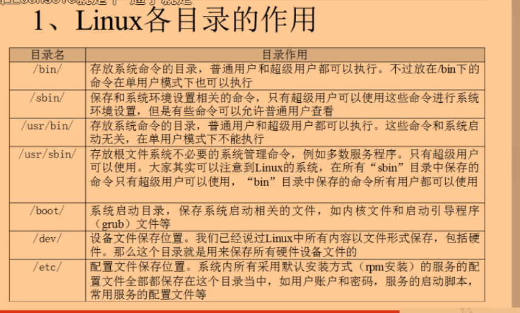
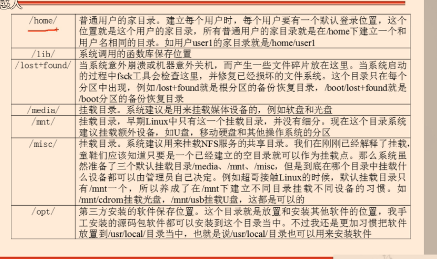
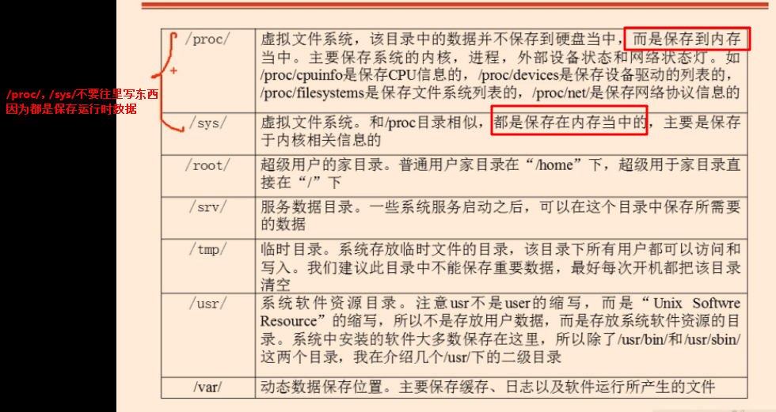

# Linux根目录下各个目录的功能介绍
  
| 目录      | 说明                                     | 备注                                                         |
| --------- | ---------------------------------------- | ------------------------------------------------------------ |
| bin       | 存放普通用户可执行的指令                 | 即使在单用户模式下也能够执行处理                             |
| boot      | 开机引导目录                             | 包括Linux内核文件与开机所需要的文件                          |
| dev       | 设备目录                                 | 所有的硬件设备及周边均放置在这个设备目录中                   |
| etc       | 各种配置文件目录                         | 大部分配置属性均存放在这里                                   |
| lib/lib64 | 开机时常用的动态链接库                   | bin及sbin指令也会调用对应的lib库                             |
| media     | 可移除设备挂载目录                       | 类似软盘 U盘 光盘等临时挂放目录                              |
| mnt       | 用户临时挂载其他的文件系统               | 额外的设备可挂载在这里,相对临时而言                          |
| opt       | 第三方软件安装目录                       | 现在习惯性的放置在/usr/local中                               |
| proc      | 虚拟文件系统                             | 通常是内存中的映射,特别注意在误删除数据文件后，比如DB，只要系统不重启,还是有很大几率能将数据找回来 |
| root      | 系统管理员主目录                         | 除root之外,其他用户均放置在/home目录下                       |
| run       | 系统运行是所需文件                       | 以前防止在/var/run中,后来拆分成独立的/run目录。重启后重新生成对应的目录数据 |
| sbin      | 只有root才能运行的管理指令               | 跟bin类似,但只属于root管理员                                 |
| snap      | ubunut全新软件包管理方式                 | snap软件包一般在/snap这个目录下                              |
| srv       | 服务启动后需要访问的数据目录             |                                                              |
| sys       | 跟proc一样虚拟文件系统                   | 记录核心系统硬件信息                                         |
| tmp       | 存放临时文件目录                         | 所有用户对该目录均可读写                                     |
| usr       | 应用程序放置目录                         |                                                              |
| var       | 存放系统执行过程经常改变的文件           |                                                              |

# linux的usr目录的全称是什么?
[https://zhuanlan.zhihu.com/p/41389799](https://zhuanlan.zhihu.com/p/41389799)

很长一段时间,我都认为是user的意义,最近才知道,原来不是 ,这里留下摆渡知道的解释,方便后来人:
usr是user的缩写，是曾经的HOME目录，然而现在已经被/home取代了，现在usr被称为是Unix System Resource，即Unix系统资源的缩写。

