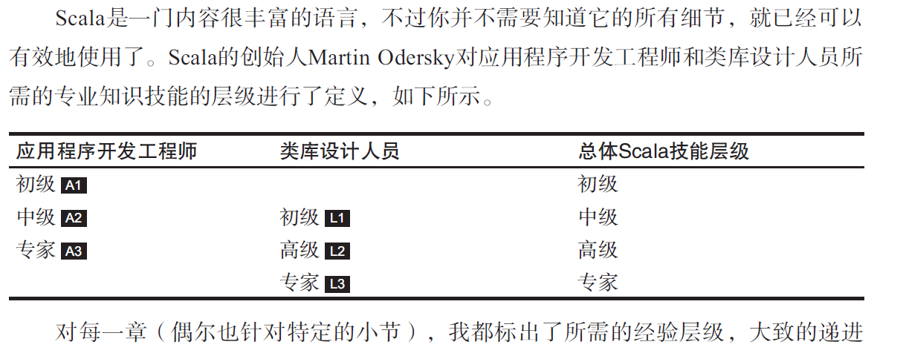
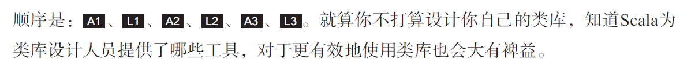
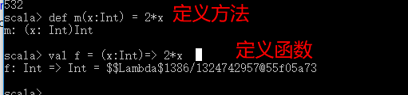

Scala 学习笔记

1.基础
1.1解析器：Tab键可以实现命令补全

1.2变量声明
常量val
变量var
必要的时候，也可以自己声明类型
val name ：String = "jack"
在scala中，可以不使用分号“；”，不过使用了也没有什么问题，只是习惯不用；
在scala中，同一行代码存在多条语句的时候，在使用分号隔开

一行多值声明，用逗号隔开
val xmax，ymax = 100
var name，address：String = null

1.3常用类型
数值类型 Byte Char Short Int Long Float Double  和 布尔类型Boolean ，这些都是类，不区分基本类型和引用类型
你可以对数字调用方法：
1.toString() //字符串 "1"
或者 1.to(10) //产出 Range(1,2,3,4,5,6,7,8,9,10)

1.4算术和操作符
scala没有 ++,--自增操作符,如果要实现自增,使用 a+=1,a-=1这种表达

1.5调用函数和方法
scala没有静态方法
引入包 import scala.math._  
_ 是通配符,表示全部,类似于java的*
没有参数的方法,scala一般不使用括号:
比如StringOps类有一个district方法,不带( ),调用方法:  "Hello".district //获取字符串中不重复的字符

1.6 apply 方法

2.控制结构和函数
2.1条件表达式
scala没有switch语句,使用模式匹配机制
2.2语句终止
scala不需要添加分号,不是必须的
2.3块表达式和赋值
块语句是一个包含于{ }的语句序列,包含一系列表达式.其结果也是一个表达式,最后一个表达式的值就是快的值

2.4输入输出

已经被放弃了,不推荐使用

2.5循环
style 1 :
while(n>0){
    r = r *n;
    n -= 1;
}
style 2:
for(i <-1 to n){
    r = r*i;
}
style 2 变型: //until 方法返回一个并不包含上限的区间
val s = "Hello";
var sum = 0;
for(i <- 0 until s.length){
    sum += s(i)
}

scala没有提供break 或 continue 跳出循环.

2.6 高级for循环和for推导式

	* 
变量 <- 表达式   提供多个生成器,用分号隔开
	* 
每个生成器都可以带一个守卫(就是条件判断)

	* 
以yield开始

2.7 函数
函数与方法的区别:方法对对象进行操作,函数不是.
定义函数: def abs(x: Double) = if(x >= 0) x else -x
多个表达式:
对于递归函数,我们必须指定返回类型,否则无法通过校验:
def fac(n: Int): Int = if(n <=0) 1 else n*fac(n-1)

2.8 默认参数和带名参数
注意带名参数并不需要跟参数列表的顺序完全一致
2.9变长参数
参数可以接受一个或者多个值

调用方法:val s = sum (1,4,2,14,12)

2.10过程 Process
过程就是没有返回值.仅仅是调用,如一个过程把一个字符串打印.没有返回任何值

定义:

2.11懒值
懒值的初始化将被推迟,关键字是 lazy
lazy val words = ....
路径故意写错,并没有报错,但是打印路径就报错了
反正就是用的时候就会报错,就是懒.
2.12 异常
Scala不需要声明说方法和函数可能会出错
考虑如下代码:
if(x>=0){
    sqrt(x)
    }else
        throw new IllegalArgumentException("x should not be negative")

try{...}catch{...}finally{...}

3.数组相关操作
3.1定长数组
定义一个数组: val nums = new  Array[Int](10) //初始化的元素值为 0

3.2 变长数组:数组缓冲
数据结构为 ArrayBuffer

定义和相关操作:

3.3遍历数组
for(i <- 0 until a.length){
    println(i+":"+a(i))
}

3.4数组转换
单词解释:
可以使用守卫过滤,然后再产出:

3.5常用算法
看一下相关api就好了,
ArrayBuffer什么的,字符串的操作
3.6Scaladoc
...文档

3.7多维数组
定义;
var matrix = Array.ofDim[Double](3,4) //三行四列
访问:
matrix(row)(column)

4.映射和元组
4.1构造映射
->操作符用来创建对偶, "Aclice" -> 10
映射: val scores = Map("Alice" ->10, "Bob" -> 3,"Cindy" -> 8);
创建了不可变的Map[String,Int],其值是不能被改变
                
4.2获取映射中的值
val bobscore =socres("Bob")
4.3更新映射中的值
scores("Bob")= 10 //更新Bob的值
scores("Jack") = 20 //增加新的键值对到scores(假设是可变的)
+=操作添加多个关系:
scores += ("Bob" -> 10,"Jack" ->20)
-=移除某个键和对应的值
scores -= "Alice"
你不能更新一个不可变的映射
4.4迭代映射

4.7 元组
映射是键/值对偶的集合,对偶是元组的最简单形态---元组是不同类型的值的聚集

4.8 拉链操作 zip()
例子:

5.类
5.1简单类和无参方法

class Counter{
    private var value = 0 //必须初始化字段
    def increment(){value += 1} //方法默认是公有的
    def current() = value    //
}
//创建对象
val myCounter = new Counter //new Counter()

6.2伴生对象
概念:与类同名的对象
6.3扩展类或者特质的对象

6.4 apply 方法
这样的形式就是调用apply( )方法
object (参数1,....参数N)

6.5应用程序对象
每个Scala程序都必须从一个对象的main方法开始,类型是:Array[String]=>Unit

6.6枚举类
scala没有枚举类

8.2重写方法
在scala中重写一个非抽象方法必须使用override修饰符 (对比：子类重写父类的抽象方法不需要使用override关键字)

---

scala 方法与函数的区别

