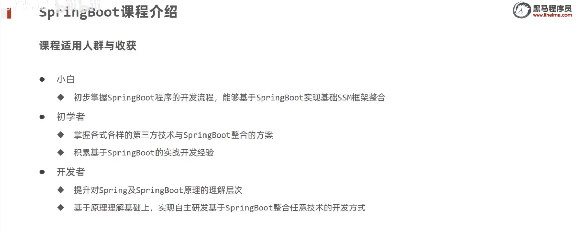
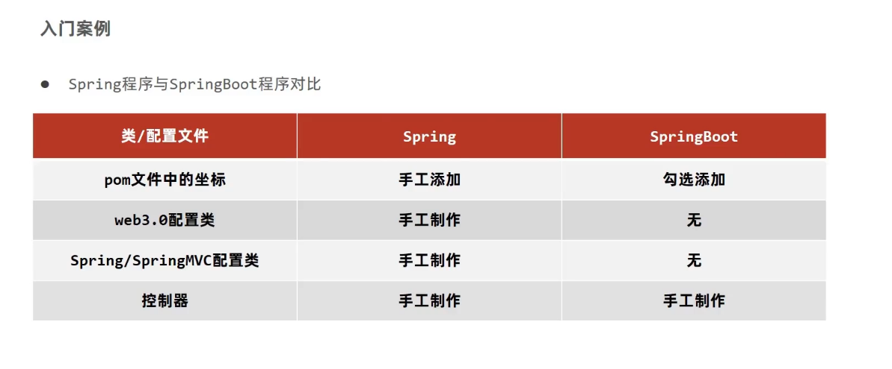
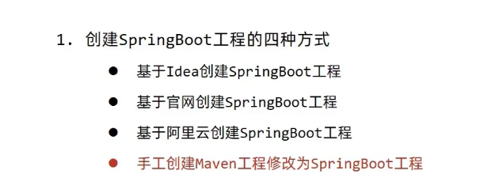
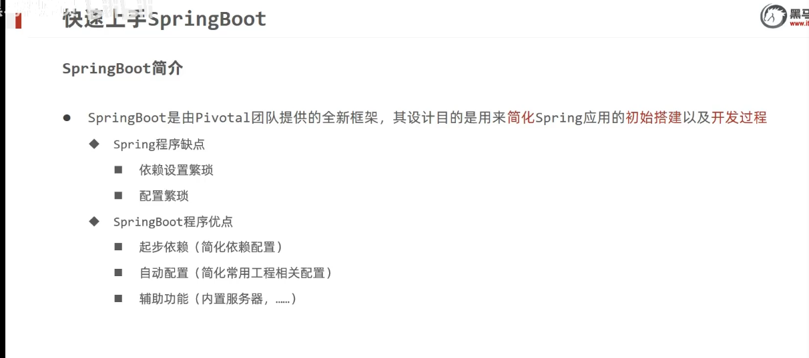
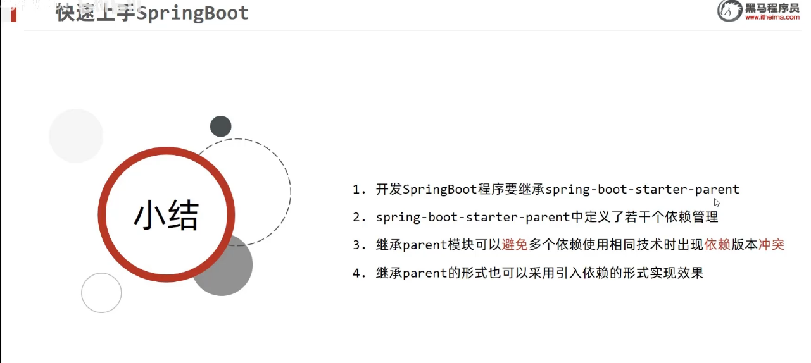
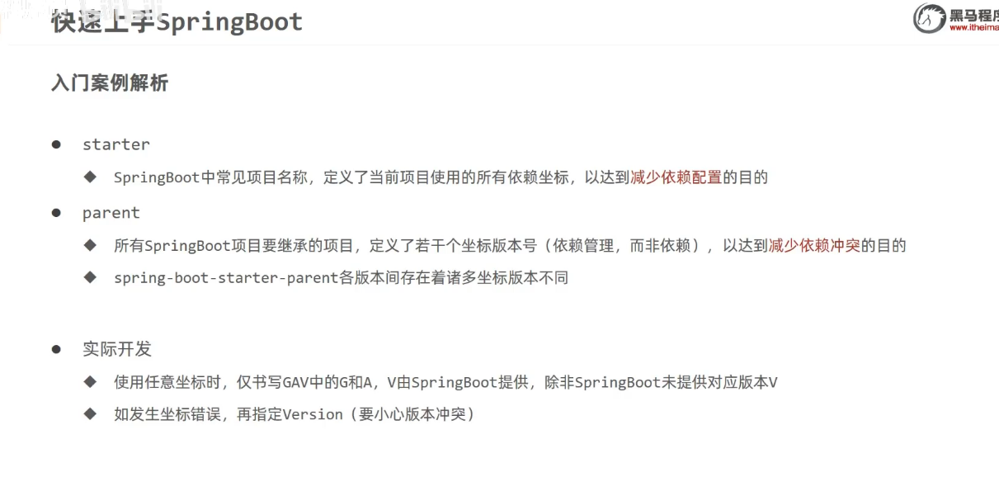
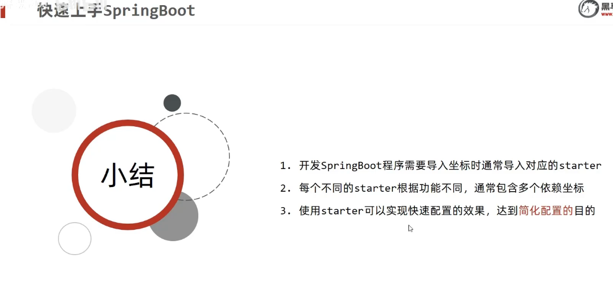
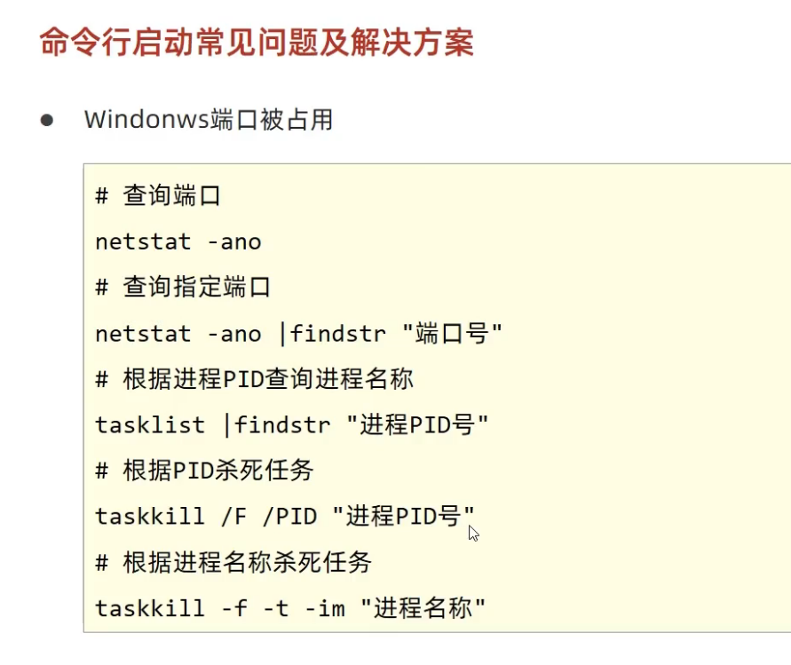

# 黑马Springboot2教程笔记

视频：https://www.bilibili.com/video/BV15b4y1a7yG?p=2

# 课程介绍

# 课程模块和目标

基础篇

- 能创建springboot工程
- 基于springboot整合ssm

实用篇

- 运维实用篇
	- 能掌握springboot程序多环境的开发
	- 基于linux系统发布springboot工程
	- 能够解决线上灵活配置springboot工程的需求
- 开发实用篇
	- 基于Springboot整合任意第三方技术

原理篇

- 掌握springboot内部工作流程
- 理解springboot整合第三方技术的原理
- 实现自定义开发整合第三方技术的组件

# SpringBoot 基础篇

目录

- 快速上手
- 基础配置
- 整合ssm

## 快速上手 springboot

## 入门案例解析：parent

springboot的优势

starter

windows杀进程：

