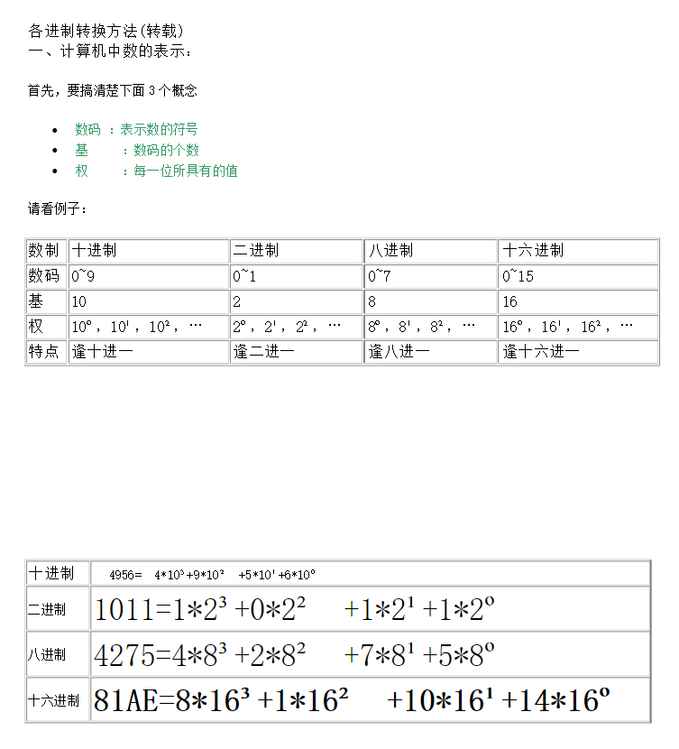

计算机存储单位
1 byte=8 bit

1 kilobyte =1024(2^10) byte

-   (b)bit ,
    
-   (B)byte ,
    
-   (Kb/kb)kilobyte,
    
-   (M/Mb)megabyte,
    
-   (G/Gb)gigabyte,
    
-   (T/Tb)terabyte,
    
-   --不常接触
    
-   petabyte,
    
-   exabyte,
    
-   zettabyte,
    
-   yottabyte,
    

  

其他一些形象的数据量:

    一张电报:100字节

    一个笑话:1KB

    一页书籍:10KB

    一张低分辨率照片:100KB

    一部微型小说:1MB

    一次胸透视:10MB

    两章百科全书:100MB

    一卷磁带:200MB

    一张CD光盘:500MB

    一部广播级质量电影:1GB

    一卷大型数字磁带:100GB

    五万棵树制成的纸:1TB

    一套大型存储系统:50TB

    NASA EOS对地观测系统三年数据:1PB

    所有印刷材料:200PB

    全人类说过的所有的话:5EB

---
  

理解一个问题就是：所有进制都可以直接互相转换，但是对于自己的来说，用十进制来过渡比较顺手。（比如二进制直接转八进制，先把二进制转十进制，再讲十进制转八进制，虽然有点麻烦）

详见：[https://wenku.baidu.com/view/4ef90c4ae45c3b3567ec8b92.html](https://wenku.baidu.com/view/4ef90c4ae45c3b3567ec8b92.html)

