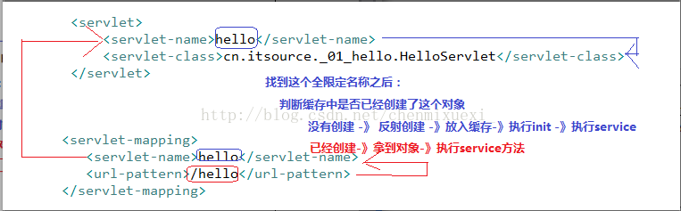
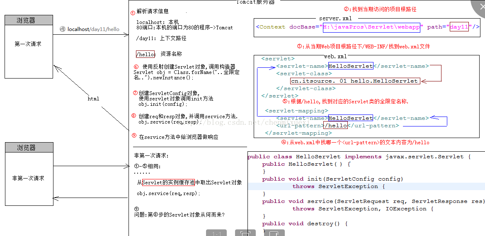

 
# 请求转发（Forward）和重定向（Redirect）的区别

Author: Yunxiong
来源网址： [https://www.cnblogs.com/Qian123/p/5345527.html](https://www.cnblogs.com/Qian123/p/5345527.html)

**forward（转发）**：

是服务器请求资源,服务器直接访问目标地址的URL,把那个URL的响应内容读取过来,然后把这些内容再发给浏览器.浏览器根本不知道服务器发送的内容从哪里来的,因为这个跳转过程实在服务器实现的，并不是在客户端实现的所以客户端并不知道这个跳转动作，所以它的地址栏还是原来的地址.

**redirect（重定向）**：

是服务端根据逻辑,发送一个状态码,告诉浏览器重新去请求那个地址.所以地址栏显示的是新的URL.

转发是服务器行为，重定向是客户端行为。

# web.xml中load-on-startup的作用

SourceURL: [http://www.blogjava.net/xzclog/archive/2011/09/29/359789.html](http://www.blogjava.net/xzclog/archive/2011/09/29/359789.html)

Author: Yunxiong

[web.xml中load-on-startup的作用](http://www.blogjava.net/xzclog/archive/2011/09/29/359789.html)

如下一段配置，熟悉DWR的再熟悉不过了：
```xml
<servlet>

   <servlet-name>dwr-invoker</servlet-name>

   <servlet-class>org.directwebremoting.servlet.DwrServlet</servlet-class>

   <init-param>

    <param-name>debug</param-name>

    <param-value>true</param-value>

   </init-param>

   <load-on-startup>1</load-on-startup>

</servlet>

<servlet-mapping>

   <servlet-name>dwr-invoker</servlet-name>

   <url-pattern>/dwr/*</url-pattern>

</servlet-mapping>
```


我们注意到它里面包含了这段配置：
```xml
<load-on-startup>1</load-on-startup>，
```
那么这个配置有什么作用呢？

贴一段英文原汁原味的解释如下：
Servlet specification:
The load-on-startup element indicates that this servlet should be loaded (instantiated and have its init() called) on the startup of the web application. The optional contents of these element must be an integer indicating the order in which the servlet should be loaded. If the value is a negative integer, or the element is not present, the container is free to load the servlet whenever it chooses.   If the value is a positive integer or 0, the container must load and initialize the servlet as the application is deployed. The container must guarantee that servlets marked with lower integers are loaded before servlets marked with higher integers. The container may choose the order of loading of servlets with the same load-on-start-up value.

翻译过来的意思大致如下：

1)load-on-startup元素标记容器是否在启动的时候就加载这个servlet(实例化并调用其init()方法)。

2)它的值必须是一个整数，表示servlet应该被载入的顺序

2)当值为0或者大于0时，表示容器在应用启动时就加载并初始化这个servlet；

3)当值小于0或者没有指定时，则表示容器在该servlet被选择时才会去加载。

4)正数的值越小，该servlet的优先级越高，应用启动时就越先加载。

5)当值相同时，容器就会自己选择顺序来加载。

```xml
所以，<load-on-startup>x</load-on-startup>，中x的取值1，2，3，4，5代表的是优先级，而非启动延迟时间。
```

如下题目：

2.web.xml中不包括哪些定义（多选）

a.默认起始页

b.servlet启动延迟时间定义

c.error处理页面

d.jsp文件改动后重新载入时间

答案：b,d

通常大多数Servlet是在用户第一次请求的时候由应用服务器创建并初始化，但
```<load-on-startup>n</load-on-startup>```  可以用来改变这种状况，根据自己需要改变加载的优先级！


# MIME类型是什么？包含哪些类型？

SourceURL: [https://www.cnblogs.com/tjudzj/p/6528008.html](https://www.cnblogs.com/tjudzj/p/6528008.html)


# JS中(function(){xxx})(); 这种写法是什么意思？

SourceURL: [http://www.cnblogs.com/beijingstruggle/p/5970824.html](http://www.cnblogs.com/beijingstruggle/p/5970824.html)

自执行匿名函数：

-   常见格式：(function() { /* code */ })();
    
-   解释：包围函数（function(){})的第一对括号向脚本返回未命名的函数，随后一对空括号立即执行返回的未命名函数，括号内为匿名函数的参数。
    
-   作用：可以用它创建命名空间，只要把自己所有的代码都写在这个特殊的函数包装内，那么外部就不能访问，除非你允许(变量前加上window，这样该函数或变量就成为全局)。各JavaScript库的代码也基本是这种组织形式。
    

总结一下，执行函数的作用主要为 匿名 和 自动执行,代码在被解释时就已经在运行了。

其他写法
```js
(function () { /* code */ } ());

!function () { /* code */ } ();

~function () { /* code */ } ();

-function () { /* code */ } ();

+function () { /* code */ } ();

```

# HTML中属性ID和属性NAME有何区别？
SourceURL:https://zhidao.baidu.com/question/105242746.html
ID和Name都可以用来标识一个标记，Javascript分别有两个方法getElementById和getElementByName来定位Dom节点。
区别如下：

1、我们知道在网页做Post提交时，是以Form（即表单域）为单位进行提交的，一个Form里有若干个表单对象(如```
<input type="text" name="UserName" value="请输入姓名"/>```
)，同一个页面里可以为多个Form（Asp.net不同，它只允许有一个，且名字必须为Form1），在表单表提交到服务器端后，可以直接通过Name属性取到表单域的值，却无法通过ID直接取到该表表单对象的值。

2、同一个Form里不能有多个name属性相同的HTML标记，但如果一个网页中有多个Form，则不同的Form里可以有同个Name属性的标记。而ID是全局的，在一个HTML文档里不能有多个节点使用相同的ID，无论它处在哪个Form里。

3、在建立CSS样式的时候，可以建立ID样式表（以＃为前缀），使具有该ID的样式直接应用该样式，而无法建立Name样式表。

4、在进行网页编辑时建议使用ID来标识一个节点，而不是使用Name（除非是为了Post提交的需要），同样使用Javascript进行Dom节点定位时建议使用getElementById方法，因为只有ID能唯一标识一个节点，而同一个网页里可能会有多个Name属性相同的节点，它们分别处在不同的Form里。

---

## Tomcat如何创建Servlet？

A.先到缓存中寻找有没有这个对象

如果没有： 1、通过反射去创建相应的对象（执行构造方法）

   2、tomcat会把对象存放到缓存中

   3、执行初始化方法init

如果有该对象，直接获取到这个对象

B. 执行服务方法

C.返回响应的数据到客户端（浏览器）

  

  

# Servlet的执行流程

一：从浏览器地址（请求）开始分析

1.http://localhost:80/servlet/hello

2.  Localhost:80 -> 找到我们的服务器

  3.  到tomcat的server.xml中找到 Context 这个配置

<Context docBase="E:\java\javaee\day13-servlet\webapps" path="servlet" />

4.  servlet: 这个Servlet找到Context中的path

  5.  通过path找到它对应的docBase,也就是找到我们工程实际地址

6.  Hello 就到我们实现的项目中找到相应的

                web.xml文件中的servlet-mapping中的url-pattern 

二、分析web.xml中的内容

1 先找到url-pattern  -》 <url-pattern>/hello</url-pattern>

2. 找到它对应的servlet-name

3 .通过mapping中servlet-name找到相应的servlet(它们的servet-name是一样的)

在servlet标签中找到它的servlet-class，它里面是全限定名称




